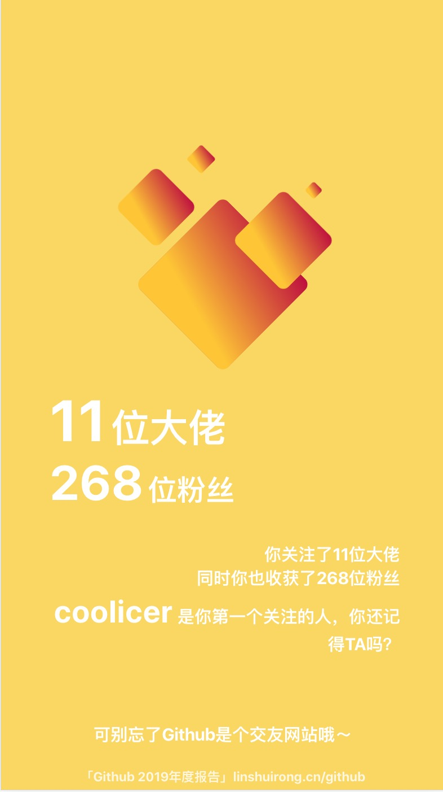
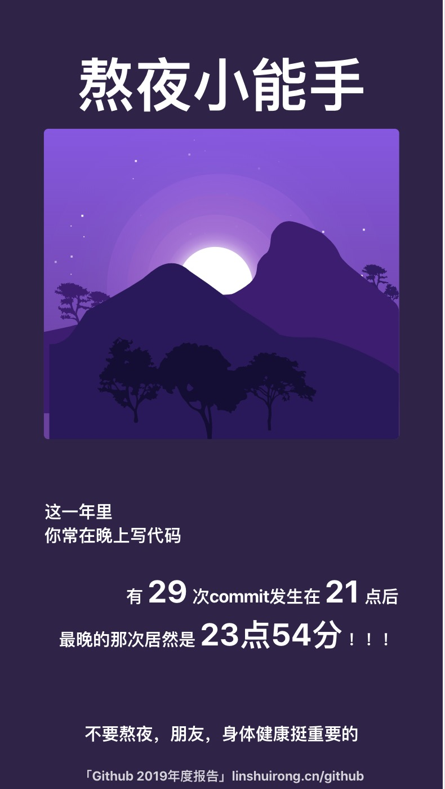
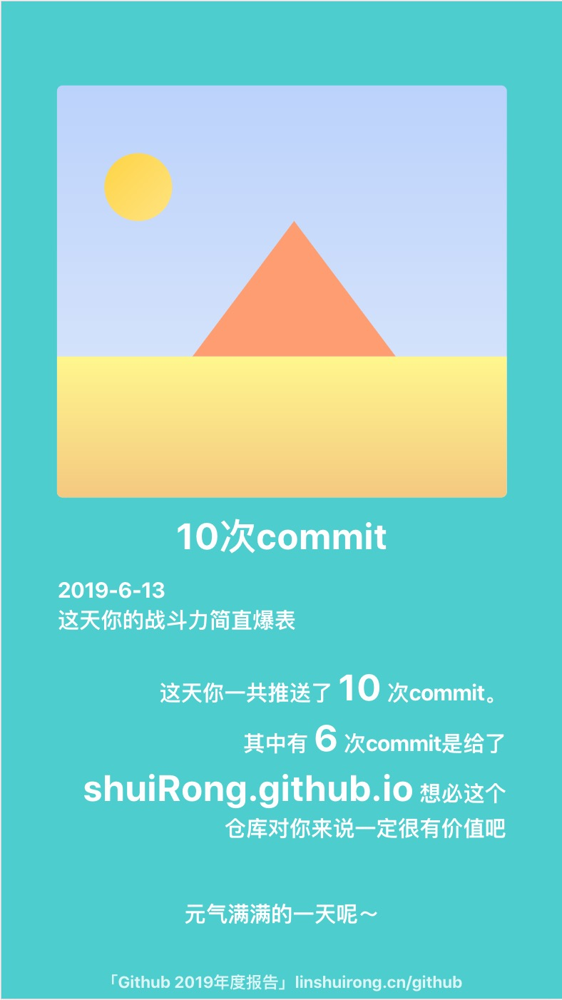
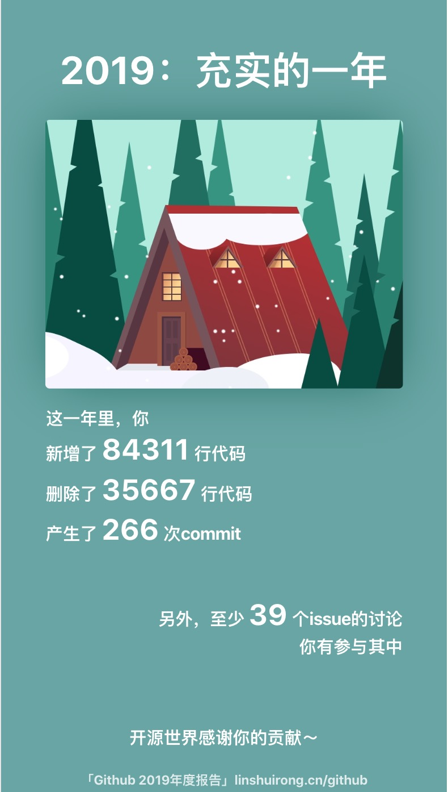

# Github 2022 Annual Report｜Github 2022 年度报告 
* 修改自https://github.com/shuiRong/github-annual-report  
* 修复了github oauth登陆
* 改用github的接口完成commit筛选

 

**2022年过去了，**

**我很怀念它。**

 

**在过去的一年中，**

**你写了多少行代码？**

**删除了多少行代码？**

**提交了多少次commit？**

**在issue区参与了多少次讨论？**

**关注了多少个大佬？**

**收获了多少个支持者？**

 

**让我来帮助你回忆～**

 

## Previews

|  |  |  |
| -------------------------- | -------------------------- | -------------------------- |
|  |  |  |

## Getting Started

1. 新建一个Github OAuth App，并配置回调链接`http://<your homepage>/oauth/redirect`
2. 安装nodejs 8（原作不支持更高版本nodejs）与yarn
3. 执行`pip install -r requirements.txt`安装后端依赖
4. 修改`src/utils.js`，填入自己的client_id, code_uri(后端工作地址), redirect_uri  
    修改`backend.py`，填入自己的client_id, client_secret
5. 执行`npm run build`编译前端工程或者执行`npm start`启动开发服务器
6. 执行`python backend.py`启动后端服务器（注意：该服务器需要能够正常访问github）

